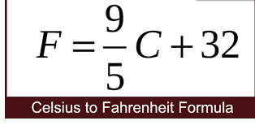

# ICS2O1 LiveHack 1

## Instructions
For each of the described problems:
* Complete the corresponding IPO Chart (see Google Classroom post0)
* Write a python solution to the problem in the appropriate file
* Use proper variable naming
* Use appropriate commenting and include a program header
* Make input and output user friendly

### Running your code
You can enter the following in the terminal to run your code:
`python3 problem1.py`
`python3 problem2.py`

## Problem 1
Your cousin is visiting from the U.S and is having trouble adjusting to the weather.  She arrived from an American city an she's having issues determining what to wear outside since she's used to reading temperatures in fahrenheit.  Write a program that allows her to enter the temperature in Celsius and converts it to fahrenheit.  Make sure it is user friendly.

## Problem 2
Students in Mr. Fabroa's class have one a contest and will receive pieces of Popeyes Chicken to be distributed among each other evenly.  The remaining pieces will be set aside for Mr. Fabroa.  Given the number of students in Mr. Fabroa's class and the number of pieces of chicken to distribute, how many pieces will each student get?  How many pieces will Mr. Fabroa get?

